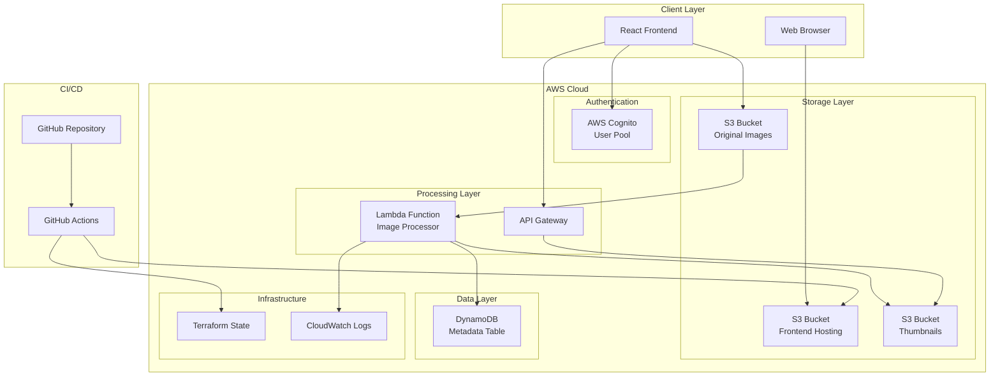
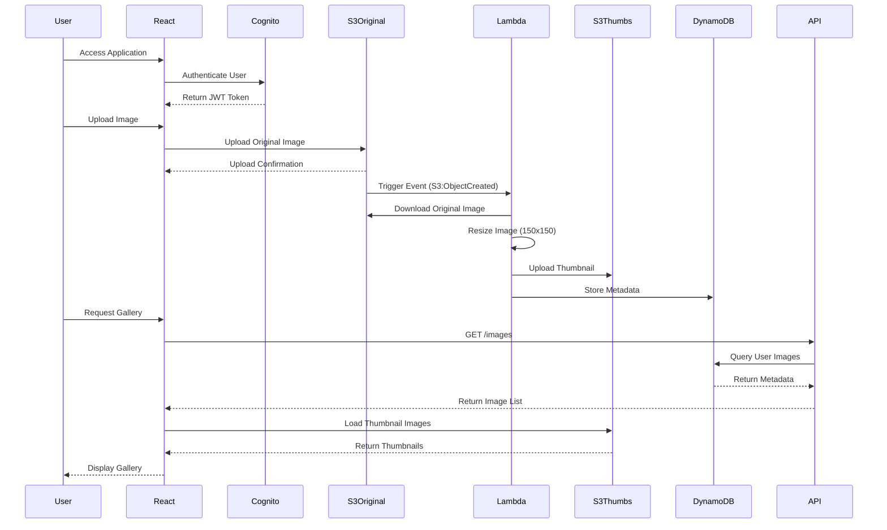

# Photo Sharing Application

**Live Application**: [Photo Sharing Application](http://photo-sharing-app-frontend-n1fhnpmx.s3-website-eu-west-1.amazonaws.com)

A serverless photo sharing application built with AWS services, featuring automatic image processing, user authentication, and scalable infrastructure managed through Infrastructure as Code (IaC).

## Table of Contents

- [Architecture Overview](#architecture-overview)
- [System Architecture](#system-architecture)
- [Data Flow](#data-flow)
- [Technical Specifications](#technical-specifications)
- [Prerequisites](#prerequisites)
- [Installation and Setup](#installation-and-setup)
- [Configuration](#configuration)
- [Deployment](#deployment)
- [API Documentation](#api-documentation)
- [Security](#security)
- [Monitoring and Logging](#monitoring-and-logging)
- [Performance Considerations](#performance-considerations)
- [Troubleshooting](#troubleshooting)
- [Contributing](#contributing)

## Architecture Overview

This application implements a serverless architecture using AWS managed services to provide a scalable, cost-effective photo sharing platform. The system automatically processes uploaded images, generates thumbnails, and stores metadata for efficient retrieval.

### Core Components

- **Frontend**: React Single Page Application (SPA) hosted on S3
- **Authentication**: AWS Cognito User Pool with email/password authentication
- **Storage**: S3 buckets for original images and processed thumbnails
- **Processing**: Lambda function for automatic image resizing and metadata extraction
- **Database**: DynamoDB for storing image metadata and user associations
- **API**: API Gateway for RESTful endpoints
- **Infrastructure**: Terraform for Infrastructure as Code
- **CI/CD**: GitHub Actions for automated deployment

## System Architecture



## Data Flow



## Technical Specifications

### Frontend Technologies
- **Framework**: React 18.2.0
- **Authentication UI**: AWS Amplify UI React 6.0.0
- **AWS SDK**: AWS Amplify 6.0.0
- **Build Tool**: Create React App
- **Styling**: CSS3 with Flexbox/Grid

### Backend Services
- **Compute**: AWS Lambda (Python 3.9)
- **Storage**: Amazon S3 (Standard Storage Class)
- **Database**: Amazon DynamoDB (On-Demand Billing)
- **Authentication**: Amazon Cognito User Pools
- **API**: Amazon API Gateway (REST API)
- **Monitoring**: Amazon CloudWatch

### Infrastructure
- **IaC Tool**: Terraform 1.5.0+
- **State Backend**: S3 with versioning enabled
- **Provider**: AWS Provider 5.0+
- **Region**: us-east-1 (configurable)

### Image Processing
- **Library**: Pillow (PIL) 10.0.1
- **Thumbnail Size**: 150x150 pixels
- **Output Format**: JPEG with 85% quality
- **Supported Formats**: JPEG, PNG, GIF, BMP
- **Maximum File Size**: 10MB

## Prerequisites

### Required Software
- **Node.js**: Version 18.0.0 or higher
- **npm**: Version 8.0.0 or higher
- **Terraform**: Version 1.5.0 or higher
- **AWS CLI**: Version 2.0.0 or higher
- **Python**: Version 3.9 or higher
- **Git**: Version 2.0.0 or higher

### AWS Requirements
- AWS Account with administrative access
- AWS CLI configured with appropriate credentials
- IAM permissions for the following services:
  - S3 (Full Access)
  - Lambda (Full Access)
  - DynamoDB (Full Access)
  - Cognito (Full Access)
  - API Gateway (Full Access)
  - IAM (Role and Policy Management)
  - CloudWatch (Logs Access)

### GitHub Requirements
- GitHub account
- Repository with Actions enabled
- AWS credentials configured as repository secrets

## Installation and Setup

### 1. Repository Setup

Clone the repository and navigate to the project directory:

```bash
git clone <repository-url>
cd photo-sharing-app
```

### 2. Project Structure

Organize your files according to this structure:

```
photo-sharing-app/
├── terraform/
│   └── main.tf                 # Infrastructure definition
├── lambda/
│   ├── lambda_function.py      # Image processing logic
│   └── requirements.txt        # Python dependencies
├── frontend/
│   ├── src/
│   │   ├── App.js             # Main React component
│   │   └── App.css            # Application styles
│   ├── public/
│   │   └── index.html         # HTML template
│   └── package.json           # Node.js dependencies
├── .github/
│   └── workflows/
│       └── deploy.yml         # CI/CD pipeline
├── setup.sh                   # Automated setup script
├── .env.example               # Environment variables template
└── README.md                  # This documentation
```

### 3. Terraform State Bucket Creation

Create the S3 bucket for Terraform state management:

```bash
aws s3 mb s3://cletus-photo-sharing-tfstate-bucket-2753 --region eu-west-1
aws s3api put-bucket-versioning \
    --bucket cletus-photo-sharing-tfstate-bucket-2753 \
    --versioning-configuration Status=Enabled
aws s3api put-bucket-encryption \
    --bucket cletus-photo-sharing-tfstate-bucket-2753 \
    --server-side-encryption-configuration '{
        "Rules": [{
            "ApplyServerSideEncryptionByDefault": {
                "SSEAlgorithm": "AES256"
            }
        }]
    }'
```

### 4. Infrastructure Deployment

Deploy the AWS infrastructure using Terraform:

```bash
cd terraform
terraform init
terraform validate
terraform plan -var="aws_region=eu-west-1"
terraform apply -auto-approve
```

### 5. Lambda Function Deployment

Package and deploy the Lambda function:

```bash
# Create deployment package
mkdir -p lambda_package
pip install -r lambda/requirements.txt -t lambda_package/ --platform linux_x86_64
cp lambda/lambda_function.py lambda_package/
cd lambda_package && zip -r ../image_resizer.zip .
cd ..

# Deploy the package
aws lambda update-function-code \
    --function-name photo-sharing-app-image-resizer \
    --zip-file fileb://image_resizer.zip
```

### 6. Frontend Configuration

Configure the React application with AWS service endpoints:

```bash
cd frontend
cp ../.env.example .env.local

# Update .env.local with Terraform outputs
terraform output -json > ../terraform_outputs.json
```

Extract and set the following environment variables in `.env.local`:

```bash
REACT_APP_AWS_REGION=eu-west-1
REACT_APP_USER_POOL_ID=<cognito_user_pool_id>
REACT_APP_USER_POOL_CLIENT_ID=<cognito_client_id>
REACT_APP_IMAGES_BUCKET=<images_bucket_name>
REACT_APP_THUMBNAILS_BUCKET=<thumbnails_bucket_name>
REACT_APP_API_GATEWAY_URL=<api_gateway_url>
```

### 7. Frontend Deployment

Build and deploy the React application:

```bash
npm ci
npm run build
aws s3 sync build/ s3://<frontend-bucket-name>/ --delete
aws s3 cp build/index.html s3://<frontend-bucket-name>/index.html \
    --cache-control="no-cache"
```

## Configuration

### Environment Variables

The application uses the following environment variables:

| Variable | Description | Example |
|----------|-------------|---------|
| `REACT_APP_AWS_REGION` | AWS region for services | `eu-west-1` |
| `REACT_APP_USER_POOL_ID` | Cognito User Pool ID | `eu-west-1_abc123def` |
| `REACT_APP_USER_POOL_CLIENT_ID` | Cognito App Client ID | `1a2b3c4d5e6f7g8h9i0j` |
| `REACT_APP_IMAGES_BUCKET` | S3 bucket for original images | `photo-app-images-xyz` |
| `REACT_APP_THUMBNAILS_BUCKET` | S3 bucket for thumbnails | `photo-app-thumbs-xyz` |
| `REACT_APP_API_GATEWAY_URL` | API Gateway endpoint | `https://api.example.com/prod` |

### Terraform Variables

Customize infrastructure deployment with these variables:

| Variable | Description | Default | Type |
|----------|-------------|---------|------|
| `aws_region` | AWS region for deployment | `eu-west-1` | string |
| `app_name` | Application name prefix | `photo-sharing-app` | string |

### Lambda Environment Variables

The Lambda function uses these environment variables (set automatically by Terraform):

| Variable | Description |
|----------|-------------|
| `THUMBNAIL_BUCKET` | S3 bucket name for thumbnails |
| `METADATA_TABLE` | DynamoDB table name for metadata |

## Deployment

### Local Development

For local development and testing:

```bash
cd frontend
npm start
```

The application will be available at `http://localhost:3000`.

### Production Deployment via GitHub Actions

1. **Configure Repository Secrets**:
   - `AWS_ACCESS_KEY_ID`: AWS access key
   - `AWS_SECRET_ACCESS_KEY`: AWS secret key

2. **Trigger Deployment**:
   ```bash
   git add .
   git commit -m "Deploy application"
   git push origin main
   ```

3. **Monitor Deployment**:
   - Check GitHub Actions tab for deployment status
   - Review CloudWatch logs for any issues

### Manual Production Deployment

For manual deployment to production:

```bash
# Deploy infrastructure
cd terraform
terraform apply -auto-approve

# Update Lambda function
aws lambda update-function-code \
    --function-name photo-sharing-app-image-resizer \
    --zip-file fileb://image_resizer.zip

# Deploy frontend
cd ../frontend
npm run build
aws s3 sync build/ s3://<frontend-bucket>/ --delete
```

## API Documentation

### Authentication

All API requests require authentication via AWS Cognito. Include the JWT token in the Authorization header:

```
Authorization: Bearer <cognito-jwt-token>
```

### Endpoints

#### GET /images
Retrieve metadata for user's images.

**Response**:
```json
{
  "images": [
    {
      "image_id": "uuid-string",
      "original_key": "filename.jpg",
      "thumbnail_key": "thumb-uuid-filename.jpg",
      "upload_time": "2023-01-01T00:00:00Z",
      "width": 1920,
      "height": 1080,
      "original_size": 2048576,
      "thumbnail_size": 15360
    }
  ]
}
```

### S3 Direct Upload

Images are uploaded directly to S3 using pre-signed URLs or Amplify Storage:

```javascript
import { uploadData } from 'aws-amplify/storage';

const result = await uploadData({
  key: 'image-filename.jpg',
  data: file,
  options: {
    contentType: 'image/jpeg',
    metadata: {
      userId: user.username
    }
  }
});
```

## Security

### Authentication and Authorization
- **User Authentication**: AWS Cognito User Pools with email verification
- **Session Management**: JWT tokens with automatic refresh
- **Password Policy**: Minimum 8 characters, mixed case, numbers required

### Data Protection
- **Encryption in Transit**: HTTPS/TLS 1.2+ for all communications
- **Encryption at Rest**: S3 server-side encryption (SSE-S3)
- **Access Control**: IAM roles with principle of least privilege

### Network Security
- **CORS Configuration**: Restricted origins for browser security
- **API Gateway**: Rate limiting and request validation
- **S3 Bucket Policies**: Public read access only for thumbnails

### Infrastructure Security
- **Terraform State**: Encrypted S3 backend with versioning
- **Secrets Management**: GitHub repository secrets for CI/CD
- **Resource Isolation**: Dedicated IAM roles per service

## Monitoring and Logging

### CloudWatch Integration

**Lambda Function Logs**:
```bash
aws logs describe-log-groups --log-group-name-prefix "/aws/lambda/photo-sharing-app"
aws logs tail "/aws/lambda/photo-sharing-app-image-resizer" --follow
```

**API Gateway Logs**:
```bash
aws logs tail "/aws/apigateway/photo-sharing-app-api" --follow
```

### Metrics and Alarms

Key metrics to monitor:
- Lambda function duration and error rate
- S3 bucket request metrics
- DynamoDB read/write capacity utilization
- API Gateway request count and latency

### Error Tracking

Common error patterns and resolutions:
- **Image Processing Failures**: Check file format and size limits
- **Authentication Errors**: Verify Cognito configuration
- **Upload Failures**: Check S3 bucket policies and CORS settings

## Performance Considerations

### Optimization Strategies

**Frontend**:
- Image lazy loading for gallery views
- Thumbnail caching with appropriate cache headers
- Bundle size optimization with code splitting

**Backend**:
- Lambda cold start mitigation with provisioned concurrency
- DynamoDB on-demand billing for variable workloads
- S3 Transfer Acceleration for global users

**Caching**:
- CloudFront distribution for static assets
- Browser caching for thumbnails (1-year TTL)
- API response caching for metadata queries

### Scalability

The serverless architecture automatically scales based on demand:
- **Lambda**: Concurrent executions scale to 1000 by default
- **S3**: Unlimited storage capacity
- **DynamoDB**: Auto-scaling read/write capacity
- **API Gateway**: 10,000 requests per second default limit

## Troubleshooting

### Common Issues

**1. Lambda Function Timeout**
```bash
# Check function configuration
aws lambda get-function --function-name photo-sharing-app-image-resizer

# Update timeout if needed
aws lambda update-function-configuration \
    --function-name photo-sharing-app-image-resizer \
    --timeout 60
```

**2. CORS Errors**
Verify S3 bucket CORS configuration in Terraform:
```hcl
resource "aws_s3_bucket_cors_configuration" "images_cors" {
  bucket = aws_s3_bucket.images.id
  cors_rule {
    allowed_headers = ["*"]
    allowed_methods = ["GET", "POST", "PUT", "DELETE"]
    allowed_origins = ["*"]
    max_age_seconds = 3000
  }
}
```

**3. Authentication Issues**
```bash
# Verify Cognito configuration
aws cognito-idp describe-user-pool --user-pool-id <pool-id>
aws cognito-idp describe-user-pool-client --user-pool-id <pool-id> --client-id <client-id>
```

**4. Image Processing Failures**
Check Lambda logs for specific error messages:
```bash
aws logs filter-log-events \
    --log-group-name "/aws/lambda/photo-sharing-app-image-resizer" \
    --filter-pattern "ERROR"
```

### Debug Commands

**Test Lambda Function Locally**:
```bash
# Create test event
echo '{
  "Records": [{
    "s3": {
      "bucket": {"name": "test-bucket"},
      "object": {"key": "test-image.jpg"}
    }
  }]
}' > test-event.json

# Invoke function
aws lambda invoke \
    --function-name photo-sharing-app-image-resizer \
    --payload fileb://test-event.json \
    response.json
```

**Validate Terraform Configuration**:
```bash
terraform fmt -check
terraform validate
terraform plan -detailed-exitcode
```

## Contributing

### Development Workflow

1. **Fork the Repository**
2. **Create Feature Branch**:
   ```bash
   git checkout -b feature/your-feature-name
   ```
3. **Make Changes and Test**:
   ```bash
   # Test infrastructure changes
   terraform plan
   
   # Test frontend changes
   cd frontend && npm test
   ```
4. **Commit Changes**:
   ```bash
   git commit -m "feat: add your feature description"
   ```
5. **Push and Create Pull Request**

### Code Standards

**Terraform**:
- Use consistent naming conventions
- Include variable descriptions
- Add resource tags for cost tracking
- Validate configurations before committing

**React**:
- Use functional components with hooks
- Implement proper error boundaries
- Follow accessibility guidelines (WCAG 2.1)
- Write unit tests for critical components

**Python**:
- Follow PEP 8 style guidelines
- Include comprehensive error handling
- Add type hints for function parameters
- Write docstrings for all functions

### Testing

**Infrastructure Testing**:
```bash
terraform validate
terraform plan -detailed-exitcode
```

**Frontend Testing**:
```bash
cd frontend
npm test
npm run build
```

**Lambda Testing**:
```bash
python -m pytest lambda/tests/
```

